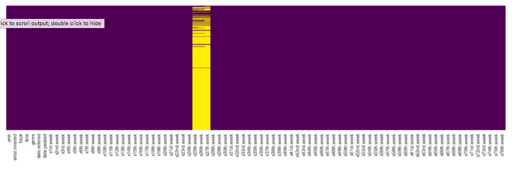
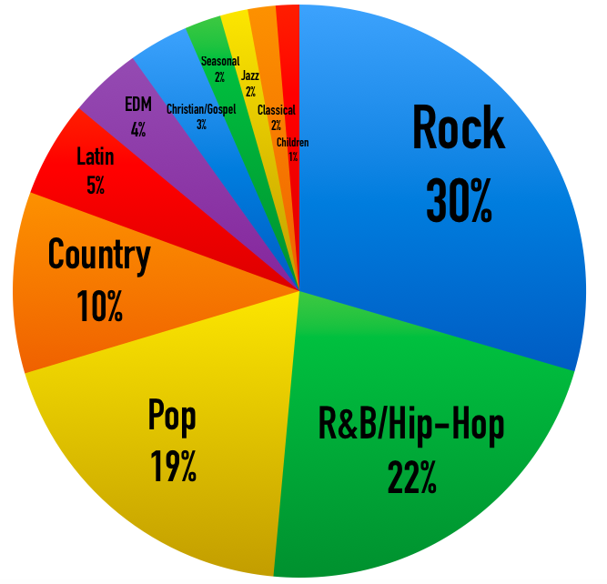
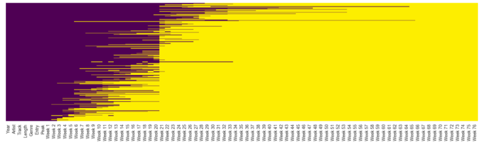
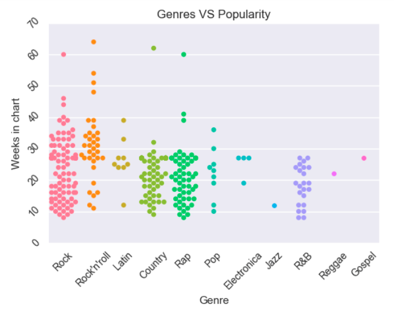
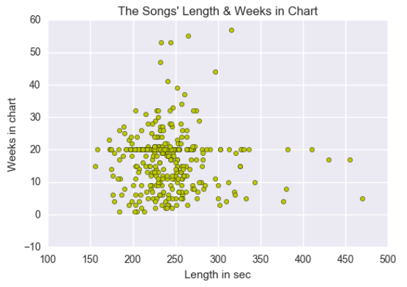
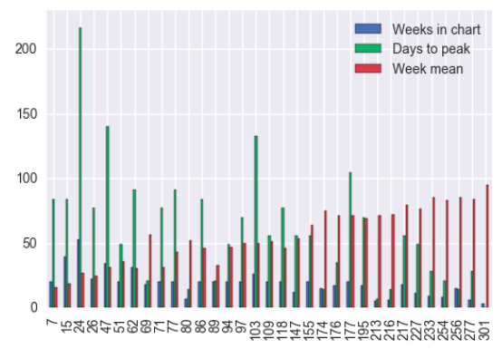
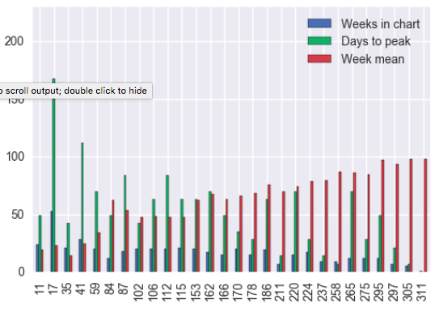
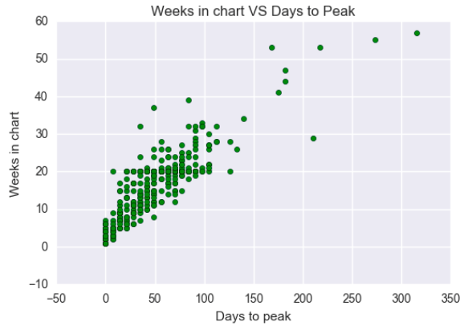

For my second project at GA I received a data set that was web-scraped from the popular web-site http://www.billboard.com/ and it represents songs which were in Top 100 in year 2000.

Now it is time to explore the data using Pandas.
The data set organized  into two-dimensional dataframe with 317 rows and 83 columns. Several columns contains collection of categorical data (artist's names, tracks, genres), other has numeric values of entered and peaked dates, a length of tracks, position in chart for 76 weeks and the year when the data was observed.
The quality of the data set remains a lot for data cleaning. All entries in columns are of the same kind, there are no duplicated columns or rows. However, there are a lot of missing values (as we see at the heatmap) and some values replaced with asterisk for a song that fell off the chart.

The labels of columns are inaccurate and I’m going to rename some of them. Types of columns are messed up, some values represent numbers but stored as type ‘string’, some values has extra characters. Names in 'genre' column have doubles.
Exploring the data set closely I noticed that genres that songs were referred to are not always correct. As a result, only 9 songs are 'Pop' however it is one of the most popular genres according to Spotify and other web-sites.

I don't want to describe cleaning process in detail but I came up with several steps:
1. Rename columns;
2. Replace asterisks witn NaN;
3. Skip meaningless colums;
4. Get rid of doubles in 'Genre' column;
5. Reformat the values in several columns;
6. Convert data types for several columns;

Finishing with cleaning I received another heatmap.

Yellow represents our NaN values.

Exploring the data set I came up with 3 hypotheses which is the main goal of the project.
1. Songs from the most popular genres stay in chart longer.
2. The length of the song influence on remaining in chart.
3. Month of entry can be significant for the popularity of a song.

#Hypothesis 1

According to the results in this graph we can see that Rock and Rock&Roll songs, which are the most popular genres, stay in chart 10 weeks longer on average. But if we take into consideration that genres in our data set was messed up it can be wrong information.
Using Scipy i received the following results: Ttest_1sampResult(statistic=0.51977379051315709, pvalue=0.60434744067441493)
It confirmed that my null hypothesis is true.

#Hypothesis 2
Failed.

It is obvious that there is no correlation between song's length and weeks that it stayed in chart. Dots are spread all over the plotting area gathering around the most common length time. So, the hypothesis that the length of the song influence on remaining in chart failed.

#Hypothesis 3

Failed.

There is no significant relation between released month and a song's popularity. I took April which is the most producing month and randomly chosen November. If we take a look at their graphs we see that they are pretty common.

The only correlation I found while exploring the data set but I had no idea about it before, is that the slower a song goes to the first place the longer it stays in chart. Slow but sure!

#Conclusion
This data set was very messed up, there was no significant correlations into the data. The starting points for every song is different however they combined into the same weeks. As a result, a lot of values in one column are with the same number and it made difficulties on exploration. The other puzzle for me why 2000 year consists of more than 70 weeks as well as data was only for year 2000.
Looking at my data set I did 3 hypotheses and only one seemed to be true. Rock music always was the most popular genre in the world and it is natural that those songs stayed in chart longer.
If I had more time I would be rather classified songs more clear and tried to group tracks taking only a set with one starting point (date of entry).
